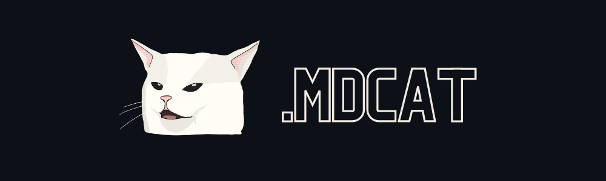

# MDCat

MDcat converts Markdown documents to [GitHub styled](https://primer.style/) HTML by leveraging the GitHub Markdown API.

## Features

- Light/dark mode
- Code highlighting

## Installation

### Prerequisites

- Go 1.18 or later installed on your system.

### Install from source

1. Clone the repository:
   ```sh
   git clone https://github.com/calganaygun/MDcat.git
   cd MDcat
   ```

2. Build the binary:
   ```sh
   go build -o mdcat mdcat.go
   ```

3. (Optional) Add to your PATH:
   ```sh
   sudo mv mdcat /usr/local/bin/
   ```

### Direct installation

You can also install directly using Go:
```sh
go install github.com/calganaygun/MDcat@latest
```

## Usage

```sh
mdcat input.md
# Or
mdcat -i input.md -o output.html
```

The generated HTML will be placed next to the input file.

## Demo

You can see this README rendered [here](https://refined-github-html-preview.kidonng.workers.dev/calganaygun/MDcat/raw/main/README.html).

## Thanks

Special thanks to [Karma](https://www.instagram.com/karmatulek.tattoo/) for the cat illustration in the header.
